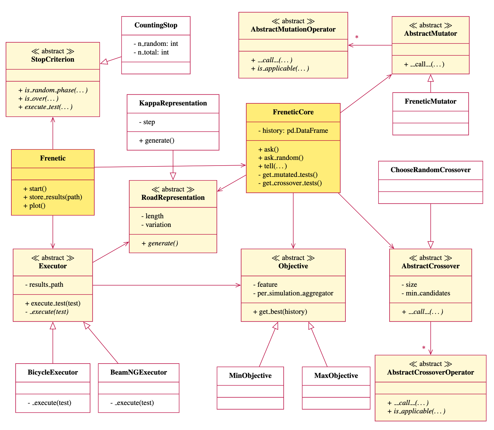
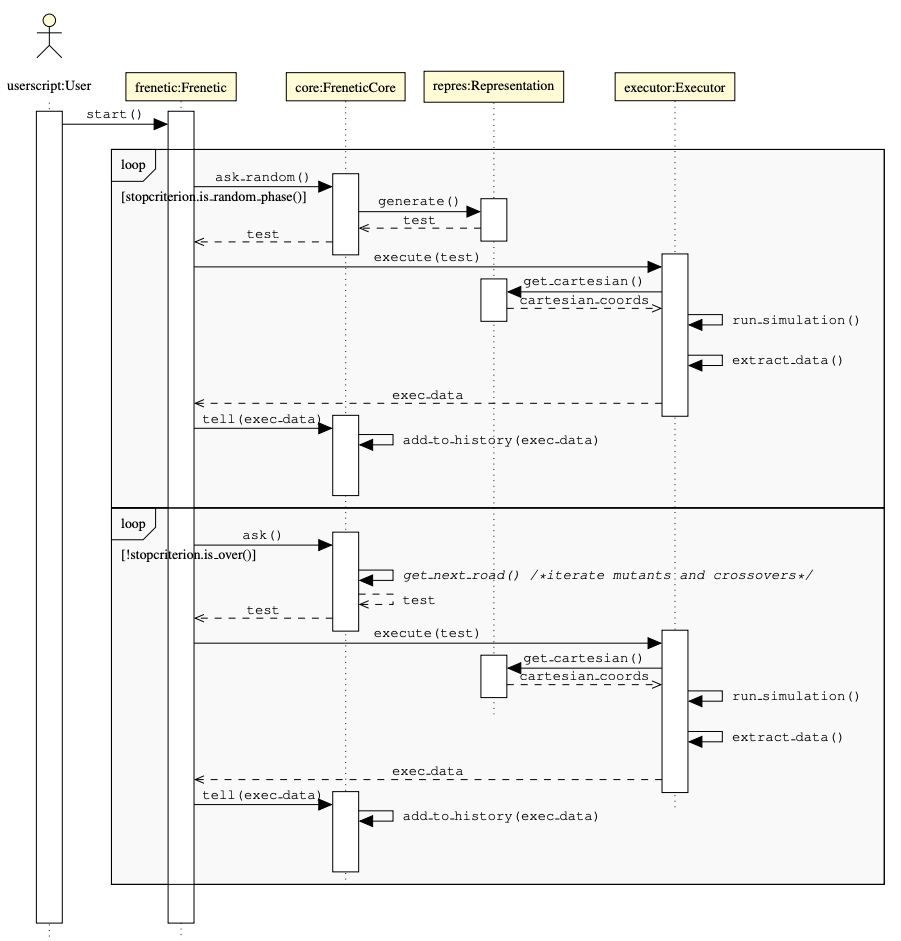

System Architecture
========================================

The two main classes
--------------------

freneticlib features two primary classes: :class:`.FreneticCore` and :class:`.Frenetic`.

- :class:`.FreneticCore` is responsible for generation of road representations and the genetic algorithm methodology.
    It applies the correct mutation and crossover operators and iteratively yields new roads.

- :class:`.Frenetic` is the orchestrator of the execution flow.
    It asks :class:`.FreneticCore` for new roads and triggers the indivudal roads' simulation.
    Furthermore, it monitors the stop criterion.

Other classes
--------------
Both :class:`.Frenetic` and :class:`.FreneticCore` have several other dependencies.
Note, however, that all these dependencies are *abstract*,
meaning that users may freely choose one of the pre-defined concrete implementations
of those abstract classes, or, alternatively, provide their own.

The respective dependencies are shown in the following class diagram:

.. note::
    This is a reduced class diagram, exemplifying the (abstract) dependencies.
    freneticlib provides (several) ready-for-use implementations for every abstract class,
    including representations, mutation and crossover operators.

    Please refer to the :doc:`./example` and the :doc:`./autoapi/index` for details on the available classes.

What happens after you ``.start()``
-----------------------------------

When calling the :class:`.Frenetic` class's :meth:`~.Frenetic.start()` method,
the class will trigger the **random search phase**.
The phase lasts as long as the stop criterion's
:meth:`~freneticlib.stopcriteria.abstract.StopCriterion.is_random_phase()` returns ``True``.

In this phase, :class:`.Frenetic` uses :meth:`.FreneticCore.ask_random()` to obtain random roads,
generated according to the chosen :class:`.RoadRepresentation`. Thus, internally, :meth:`.FreneticCore.ask_random()` calls :meth:`.RoadRepresentation.generate()`.

Subsequently, the road (a.k.a. *test*) is handed over to the defined :class:`.Executor`'s :meth:`~.Executor.execute_test(test)`,
which is responsible for:
    1. transformation from the road representation to cartesian coordinates,
    2. creating the simulation artefacts (e.g. required map & configuration files),
    3. execution of the simulation, and
    4. extraction of the simulation data.

Afterwards, :class:`.Frenetic` informs the core about the simulation result via :meth:`.FreneticCore.tell(exec_data)`,
and launches the next iteration.

.. note::
    In the figure below, the methods :meth:`run_simulation()` and :meth:`extract_data()` are mere indicators
    for what is happening. In fact, an executor has only one required method, namely :meth:`.Executor._execute`,
    which is automatically called by :meth:`.Executor.execute_test`.

After the random search, :class:`.Frenetic` will proceed to the **genetic phase**,
where a genetic algorithm methodology is applied.
The execution flow is very similar to the random phase, with the difference that now, :class:`.Frenetic` calls
:meth:`.FreneticCore.ask()` to obtain a new road. This road is yielded after applying mutation or crossover operators on
the previously simulated roads.
Depending on the outcome, different mutation operaters may be applied (referred to as *mutators* and *exploiters*),
to enable small (exploitation) or major (exploration) modification.

The rest of the loop (:meth:`.Executor.execute_test`, :meth:`.FreneticCore.tell`) is equivalent to the random phase.

